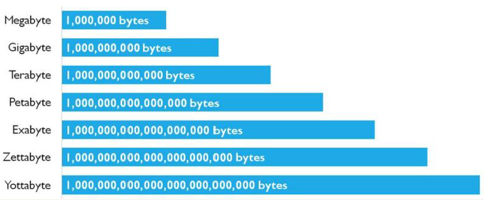
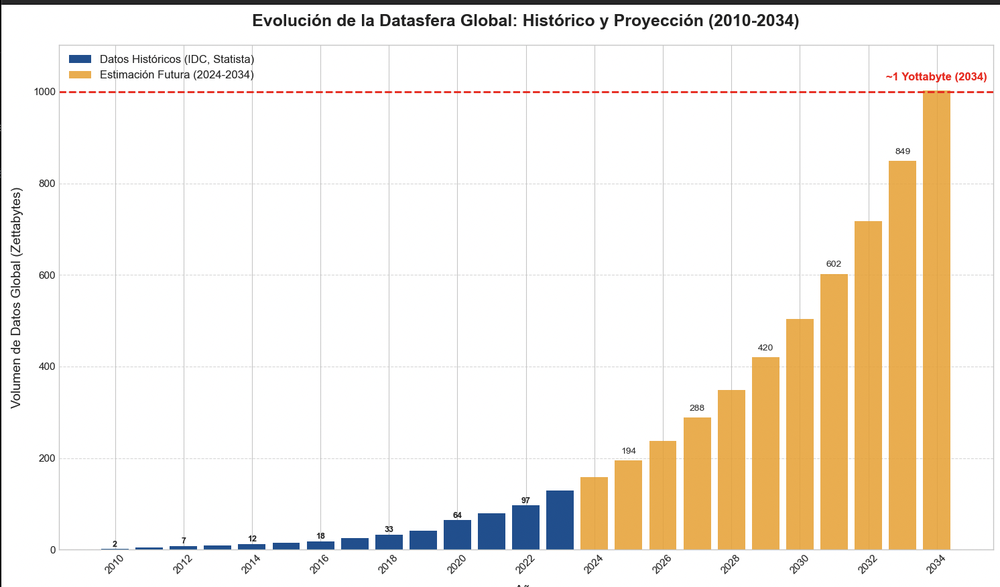
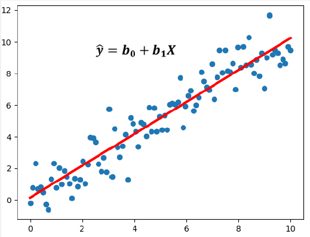
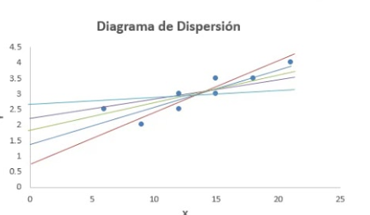
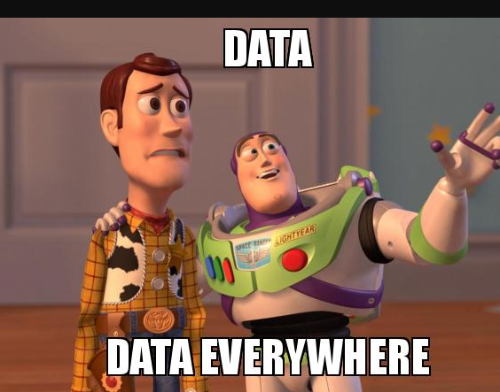
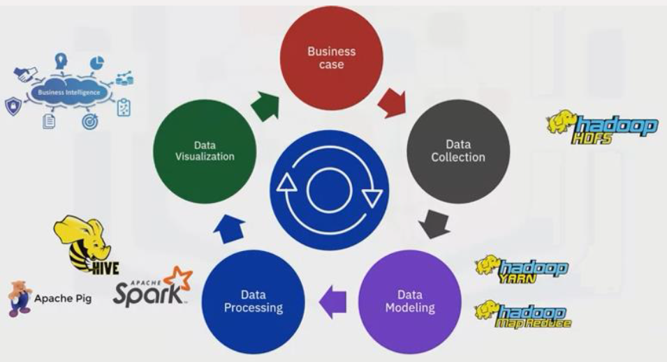

# 02. Fundamentos de Big Data

En esta sección vamos a entender: 

* Qué es el Big Data.
* Qué problemas soluciona.

# 02.1 ¿Qué es Big Data?

Aunque no hay ninguna definición que se acepte de forma "oficial", hay una definición que personalmente me gusta mucho:

_Big Data es el conjunto de herramientas y estrategias que permiten adquirir, almacenar y explotar una determinada información, que por diversas circunstancias, no se puede hacer con las técnicas o herramientas tradicionales._

Big Data es un proceso caro, pensemos que necesitaremos:
* Herramientas software especializadas.
* Hardware especialidado
* Personal con experiencia capacitado para hacer la tarea correctamente. 

Por lo tanto aunque Big Data e IA, están muy de moda, deberemos de asegurarnos de que es realmente necesario acudir al Big Data. En definitiva podemos caer el típico problma de un sobrecoste y sobreesfuerzo por intentar matar moscas a cañonazos.

Fijémonos en la siguiente imagen:

* Una película HD en 1080 que ocupase un Zettabyte , duraría 36 millones de años

* Google : El conglomerado procesa un volumen de datos que se estima superior a los 100 Petabytes (PB) por día. Solamente su motor de búsqueda gestiona aproximadamente 8.5 mil millones de búsquedas diarias, cada una de las cuales desencadena complejos algoritmos que consultan y cruzan índices masivos en fracciones de segundo. Esto no incluye el volumen generado por servicios como YouTube (más de 500 horas de video subidas por minuto), Gmail, Google Maps y la plataforma Google Cloud.

* Meta (Facebook, Instagram, WhatsApp): La infraestructura de Meta almacena varios Exabytes (EB) de datos de usuarios. Diariamente, sus sistemas ingieren más de 600 Terabytes (TB) de datos nuevos solo en sus data warehouses. Se generan más de 4 PB de datos a través de las interacciones de los usuarios (publicaciones, me gusta, comentarios, mensajes), que son analizados en tiempo real para la personalización del contenido y la segmentación publicitaria.

* Amazon: Su operación de comercio electrónico y, fundamentalmente, Amazon Web Services (AWS), representa uno de los mayores ecosistemas de datos del mundo. Se estima que AWS almacena exabytes de datos en su servicio S3. La división de retail analiza terabytes de logs de clics de clientes por hora para optimizar su motor de recomendación, la gestión de inventario y la dinámica de precios.

* Sector Aeronáutico - Motores a reacción modernos: Un solo motor de avión, como los utilizados en un Boeing 787 o un Airbus A350, genera más de 20 Terabytes de datos por cada hora de vuelo. Estos datos provienen de miles de sensores que monitorizan la presión, temperatura, vibraciones y otros parámetros críticos para el mantenimiento predictivo y la optimización de la eficiencia del combustible.

* Investigación Científica - El Gran Colisionador de Hadrones (LHC) del CERN: Considerado uno de los mayores generadores de datos científicos, los experimentos en el LHC producen aproximadamente 90 Petabytes de datos brutos al año. Antes del filtrado y la reconstrucción, las colisiones de partículas generan datos a una tasa de 1 Petabyte por segundo.

Un ejemplo de consumo podemos verlo en la siguiente gráfica

Podemos entender a partir de esta información que Big Data es un problema Grande, y nunca mejor dicho. ¿Como podríamos calcular una media de edad en un conjunto de datos de 1 terabyte? ¿Cuánta RAM necesito? ¿Cuánto tiempo se puede tardar en condiciones normales? ¿ Y un petabyte?

Por ejemplo BERT que es primo muy pequeño de ChatGPT4, se entrenó con unos 3.300 millones de palabras y requirió unos 1.843.200 Teraflops por segundo, donde un TeraFlop es un billón de instrucciones en coma flotante por segundo.

# 02.1 Pero.... ¿Porqué se necesitan tantos datos? 

Desde pequeños hemos aprendido que si tenemos una función podemos generar infinitos valores para la misma, pero qué ocurre cuando no tenemos la función y tenemos que obtener una aproximación a la misma mediante datos? Es decir, ¿Qué ocurre cuando tenemos justo el problema inverso? Tengo una serie de puntos y necesito obtener la función. 

Si lo pensamos, sería increible poder tener una función que me dijera exáctamente qué va a subir y a bajar en la bolsa. El que tuviera esa función sería multi-multi... millonario, por tanto, ¿Porqué no intentar conseguirla?.

El problema es que no es sencillo, el mero hecho de un humano tomando una decisión en un momento, puede hacer que acciones bajen o que suban, es decir, los parámetros del modelo de predicción son tantos, que es imposible eliminar la incertidumbre en este problema. 

De cualquier forma no es lo mismo tener 3 puntos e intentar calcular la recta que hemos visto antes, que tener mil puntos.

Fijaos en la siguiente imagen, en la que intentamos predecir la recta de regresión del ejemplo anterior pero con pocos puntos: 

Cómo podéis observar cuantos más puntos, más sencillo va a ser obtener la mejor recta posible. Pensad en el caso de que únicamente tuviéramos un único punto, tendríamos infinitas rectas!!!, con lo que la única forma de alejarnos del infinito y acercarnos a la precisión es tener más punto. 

Aunque los ejemplos se basan en una regresión lineal sencilla, podéis entender que las redes neuronales se basan en lo mismo, ... Ostras! igual no es descabellado que Ellon compre twitter y se hunda en bolsa!!, que pasa con los datos que ha adquirido.... Uhm..... Hay veces que únicamente necesitamos datos!

# 03. Ciclo de Vida

En la siguiente imagen podemos observar que el big data es un conjunto de áreas, cada una de las cuales puede tener unas capcidades técnicas: 

* Business Case. Todo comienza con un problema, ... Tenemos un problema o queremos obtener un beneficio de algo y necesitamos resolverlo. 

* Data Collection. Como hemos visto, el primer paso, es almacenar la información. Este proceso no es tan sencillo como parece:
  * Bases de datos distintas
  * DataSources diferentes, por ejemplo, ¿y si sacamos información de los videos de youtube??
  * Velocidad en la generación de datos, IOT
  * Capacidad de almacenamiento. ¿Como almacenará netflix toda esa información=, y ¿Spotify?
  * Durabilidad. Hay datos que nunca se pueden perder!
  * ...

* Data Modeling. De todas las fuentes de datos, podrían ocurrir que para algo que semánticamente signifique lo mismo, pudiera ser que distintos equipos, departamentos, empresas o indivíduos, tengan un concepto distinto y lo guarden de forma diferente. ¿Cómo se unifica toda la información en un único dato que representa la información verídica?
  
* Data Processing. Obviamente si tenemos toda esa cantidad de DATOS, es porque en algún momento tenemos que obtener INFORMACIÓN de ellos, ... Uhmm, no es lo mismo... Pues no, tenemos que realizar un proceso de transformación (al menos uno).
  
* Data Visualization. En este punto hemos hecho una cantidad ingente de trabajo, definiendo el problema, adquiriendo datos, procesando datos, ... Para poder tener, en muchas ocasiones un PowerPoint que será lo que vea el cliente y experto en negocio y nos dirá si todo ha merecido la pena o tenemos que modificar algo. La visualización de datos es algo sencillo e intuitivo que la gente no IT, es decir Bussiness, pueda entender y sacar sus conclusiones, es decir, cuadros de mando como por ejemplo Power Bi. Al final si lo pensamos, ... mucho de nuestro trabajo es para obtener la información lo más sencilla posible y necesaria para que los expertos en negocio, sepan que decisión tomar, o al menos que les ayude a eliminar ese concepto tan molesto,... La incertidumbre.

En el útimo momento vemos que hay una flecha... Vaya, volvemos a empezar? Sí, o no, si al final lo que hemos obtenido no elimina la incertidumbre y Bussiness sigue sin saber que decisión tomar, necesitaremos volver a replantear el problema y modificar lo que haga falta para que ellos topen la decisión correcta. Pensemos que vivimos en una economía voraz, en la que determinadas informaciones pueden hacer que nos destaquemos o que vayamos a quiebra. **Ese es nuestro trabajo, indagar en los datos para poder ayudar las tomas de decisiones complejas del mundo que nos rodea.**
