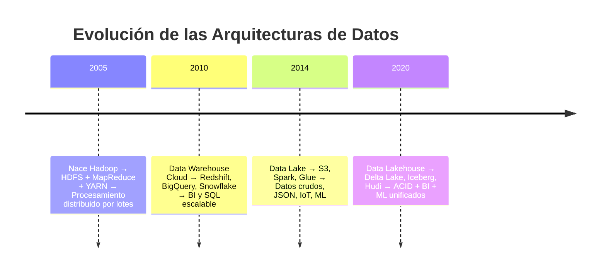

# Evolución de las Arquitecturas de Datos

El mundo del *Big Data* ha evolucionado enormemente en los últimos 20 años.
Podemos entenderlo como una **línea temporal de cuatro generaciones**, cada una respondiendo a los límites de la anterior.

##  **1️⃣ Era Hadoop (2005–2015)**

**Objetivo:** poder almacenar y procesar volúmenes masivos de datos con hardware barato.

### 🔹 Arquitectura base: **Hadoop Ecosystem**

| Componente                                | Función                                                            | Equivalente moderno                                           |
| ----------------------------------------- | ------------------------------------------------------------------ | ------------------------------------------------------------- |
| **HDFS (Hadoop Distributed File System)** | Almacenamiento distribuido de archivos grandes.                    | 🪣 Amazon S3 / Azure Data Lake Storage / Google Cloud Storage |
| **MapReduce**                             | Procesamiento batch (por lotes) paralelo sobre los datos en disco. | ⚙️ Apache Spark (procesamiento en memoria)                    |
| **YARN**                                  | Gestor de recursos (CPU, RAM) entre los nodos del clúster.         | ☁️ Kubernetes / Cloud Compute Managers                        |
| **Hive / Pig**                            | Consultas tipo SQL sobre datos en HDFS (Hive Metastore).           | 🔍 Spark SQL / Snowflake / BigQuery                           |
| **Sqoop / Flume**                         | Ingesta de datos desde bases relacionales y logs.                  | 🔄 Apache Kafka / AWS Kinesis                                 |
| **Oozie**                                 | Orquestación de flujos de trabajo (DAGs).                          | 🧩 Apache Airflow / dbt                                       |

🔸 **Ventaja:** escalabilidad horizontal (puedes añadir nodos baratos).
🔸 **Limitaciones:**

* Lentitud (mucho I/O en disco).
* Solo batch, nada de tiempo real.
* Ecosistema complejo y difícil de mantener.

👉 Hadoop fue **la primera generación del Big Data moderno**. Sentó las bases, pero pronto se quedó corto.

---

##  **2️⃣ Era del Data Warehouse Moderno (≈2010–2020)**

**Objetivo:** análisis estructurado y rápido con SQL, orientado al negocio.

### 🔹 Arquitectura típica

* Almacenamiento estructurado (tablas limpias).
* Procesamiento **ETL** (se limpia antes de guardar).
* Consultas OLAP optimizadas.

### 🔹 Ejemplos

* **On-premise:** Teradata, Oracle Exadata.
* **Cloud:** Snowflake, Amazon Redshift, Google BigQuery, Azure Synapse.

🔸 **Ventajas:**

* Alta velocidad de consulta y transacciones ACID.
* Ideal para BI y reporting.

🔸 **Limitaciones:**

* Datos solo estructurados.
* Rigidez de esquema.
* Coste alto (hardware especializado).

👉 El Data Warehouse resuelve el *reporting empresarial*, pero no puede manejar datos crudos, imágenes, sensores o logs.

---

##  **3️⃣ Era del Data Lake (≈2014–2022)**

**Objetivo:** almacenar cualquier tipo de dato a gran escala y bajo coste.

### 🔹 Arquitectura típica

| Capa                  | Función                              | Ejemplos                          |
| --------------------- | ------------------------------------ | --------------------------------- |
| **Almacenamiento**    | Repositorio masivo de datos crudos.  | AWS S3 / Azure Blob / GCP Storage |
| **Procesamiento ELT** | Cargar primero, transformar después. | Apache Spark / Databricks / Flink |
| **Catálogo de datos** | Índice para localizar datasets.      | AWS Glue / Hive Metastore         |
| **Visualización**     | Consultas SQL / exploración.         | Athena / Presto / Trino           |

🔸 **Ventajas:**

* Bajo coste (almacenamiento de objetos).
* Flexibilidad (estructurados, JSON, vídeo, texto...).
* Perfecto para *machine learning*.

🔸 **Limitaciones:**

* Sin control transaccional (no ACID).
* Sin gobierno fuerte de datos.
* Dificultad de integrar BI y ML en el mismo entorno.

👉 El Data Lake democratizó el acceso al dato, pero **no garantizaba la calidad ni la consistencia.**

---

## **4️⃣ Era del Data Lakehouse (≈2020–presente)**

**Objetivo:** unificar analítica de negocio (BI) y ciencia de datos (ML) sobre un único lago estructurado.

### 🔹 Arquitectura híbrida

| Capa                             | Función                                      | Ejemplos                                                                           |
| -------------------------------- | -------------------------------------------- | ---------------------------------------------------------------------------------- |
| **Almacenamiento**               | Lago de datos (como en Data Lake).           | S3, ADLS, GCS                                                                      |
| **Formato de tabla ACID**        | Añade estructura, versiones y transacciones. | 🧱 Delta Lake (Databricks), Apache Iceberg (Netflix/Snowflake), Apache Hudi (Uber) |
| **Motor de consultas unificado** | SQL + ML + streaming.                        | Spark SQL, Trino, Presto, Databricks Runtime                                       |
| **Catálogo de metadatos**        | Define esquemas y permite “time travel”.     | Unity Catalog (Databricks), AWS Glue Catalog                                       |
| **Orquestación / ML / BI**       | Un mismo dato sirve para todo.               | Airflow / dbt / Power BI / Tableau                                                 |

🔸 **Ventajas:**

* Soporta datos estructurados y crudos.
* Transacciones ACID (consistencia).
* Time Travel (versionado histórico).
* Un mismo dataset sirve para BI y ML sin duplicación.

🔸 **Limitaciones:**

* Complejidad conceptual.
* Requiere herramientas modernas (Spark, Iceberg, Delta).

👉 El Lakehouse **fusiona el control del Data Warehouse con la flexibilidad del Data Lake.**
Es el modelo dominante actual (Databricks, Snowflake, BigLake...).

---

## Línea Temporal Visual

---

## Comparativa Conceptual

| Generación         | Tipo de Datos        | Procesamiento     | Transacciones          | Costo | Casos de Uso           | Ejemplos                          |
| ------------------ | -------------------- | ----------------- | ---------------------- | ----- | ---------------------- | --------------------------------- |
| **Hadoop**         | Estructurados / semi | Batch (MapReduce) | No                     | Medio | Logs masivos, indexado | HDFS, Hive, Pig                   |
| **Data Warehouse** | Estructurados        | Batch/SQL         | Sí (ACID)              | Alto  | BI, Reporting          | Redshift, Snowflake               |
| **Data Lake**      | Todos                | Batch/Streaming   | No                     | Bajo  | ML, Data Science       | Spark, S3, Glue                   |
| **Data Lakehouse** | Todos                | Batch + Streaming | Sí (ACID, Time Travel) | Medio | BI + ML + IA           | Databricks (Delta), Iceberg, Hudi |

