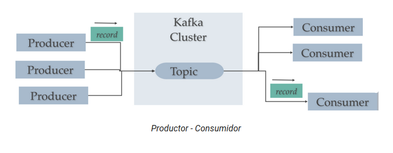

https://developer.confluent.io/learn-kafka/apache-kafka/events/
# Introducción

Apache Kafka es una plataforma de streaming que se usa para recoger, procesar, guardar e integrar datos en escala. Tiene numerosos casos de uso incluyendo:
- Logs distribuidos
- Procesamiento de flujos.
- Integración de datos
- Mensajería Pub / Sub 

Para enteder completamente lo que hace kafka, vamos a profundizar en el significado de **plataforma de eventos**, así como su funcionamiento.

Es en definitiva es una plataforma de gestión de mensajes asíncronas capaz de manejar billones de peticiones al dia con latencias de menos de 10ms. La temporalidad de los mensajes es flexible, pudiendo ir desde no guardar, hasta dejar almacenados indefinidamente. 

Se emplea en muchos casos, uno por ejemplo puede ser servir como pantalla para almacenar mensajes con el objetivo que un consumidor lento pueda ingestarlos poco a poco.

## ¿Qué son lo eventos?

Podemos definir un evento como cualquier tipo de acción, incidente o cambio que es identificado o registrado por le software o las aplicaciones. Por ejemplo un pago, un clic en un sitio web o una lectura de temperatura junto con la descripción de lo que ha ocurrido. 

Es por tanto un binomio formado por la notificación (elemento) y el estado. Dicho estado suele ser pequeño y por tanto tenemos que usar algún objeto serializado, entre los que destacan JSON, Apache Avro o los Protocol Buffers.

## Publicador subscriptor 

De un vistazo muy rápido el modelo de publicador subscriptor de kafka funciona de la siguiente forma:
- Topic: 
  - Es el buffer donde se almacenan los eventos o mensajes
  - Estos mensajes son publicados por el **productor**
  - Son consumidos por el **subscriptor**, aunque el tiempo en el que permanecerán en el buffer puede ser gestionado.
  - En ningún momento el subscriptor y el consumidor se conocen, siempre lo hacen mediante **kafka** como intermediario haciendo uso de los **topics**
   

## Kafka y Evetos Pareja Key-Valor 
Kafka se basa en la abstracción de un registro distribuido de confirmaciones. Al dividir el registro en particiones consigue escalar los sistemas. Como tal Kafka modela los eventos como pares Key-Value.   
Para Kafka, los key-value son una secuencia de Bytes, pero para el productor o consumidor pueden ser objetos concretos en algún tipo de formato, como JSON, JSON-Schema, Avro o Protobuf.  

Los valores suelen ser la representación serializada de un objeto de dominio de la aplicación o alguna forma de entrada de mensajes en bruto como la salida de un sensor.

Las claves también pueden ser objetos de dominio complejos, pero suelen ser tipos primitivos como cadenas o enteros. La parte clave de un evento Kafka no es necesariamente un identificador único para el evento como sí que lo sería en una tabla de un modelo relacional, es más bien el identificador de alguna entidad del sistema como un suario, una orden o algún dispositivo conectado.

Las claves son cruciales, ya que Kfka las usa para la paralelización y la localidad de los datos.

## Topics
En un sistema pueden ocurrir muchísimos eventos que además es probable que tengan diferente naturaleza. Por ello necesitamos un sistema para organizarlos. 

La unidad de organización más fundamental de Apache Kafka es el **topic**, el cual podría ser entendido como una especie de tabla dentro del modelo relacional. Podemos crear diferentes topics, uno por tema a tratar. Crearemos diferentes topics para mantener distintos tipos de eventos, incluso para tener versiones filtradas y transformadas del mismo evento.

Un topic es un log de eventos. Los logs son datos simples estructurados. Los logs siempre escriben lo más nuevo al final, dejando alejado en el tiempo aquellos logs que son más antiguos, tal como funcionan las colas. Los logs se suelen leer de forma secuencial. Los logs son **inmutables**, lo que significa que una vez añadidos, no se pueden modificar, ya que si ha ocurrido algo, sería complicado entender que no ha pasado. 

Los topics pueden ser gestionados para que almacenen la información durante un tiempo y luego automáticamente se borra, o podemos dejarlo indefinidamente. También podemos decir a kafka que dado un tamañó máximo empiece a borrar dichos mensajes.

De una forma más visual podemos entender el topic como un contenedor para eventos similares.

## Particiones
Puede ocurrir que tengamos un sistema en el cual se produzcan una cantidad ingente de eventos, los cuales se almacenarán en el mismo topic. Ésto provocaría que el topic ocupase demasiado en kafka, sería muy grande y provocaría un problema para la escalabilidad de kafka. 

Kafka se diseño con el concepto de particiones del topic, con lo cual dividimos los topics en tamaños más pequeños. Cada partición puede ser alojada en un nodo distinto del cluster. Con ello conseguimos que escribir, almacenar o procesar mensajes puede dividirse en muchos nodos del cluster.

Las particiones se definen cuando creamos un topic, en ese momento le decimos las particiones como van.

El tiempo que se almacena un mensaje en una partición es gestionable, pero por defecto es una semana.

### Funcionamiento.
Una vez hemos dividido un topic, tenemos que definir un mecanismo para decidir qué mensajes se escriben en qué particiones. A los mensajes les podemos añadir clave pero no es obligatorio.  
    - En el caso de que un mensaje no tenga key se distribuirá entre todaas las máquinas del topic. Estos nodos, recibirán una parte equitativa de los datos, pero no conservarán el orden de los mismos. 
    - Por otro lado, cuando sí que le hemos metido una clave, la partición de destino se calculará a partir de un hash de la clave, lo que garantiza que estén ordenads.

Por ejemplo, imaginemos que se están produciendo eventos y que todos los eventos están asociados al mismo cliente. El uso del ID de cliente como clave, garantiza que todos los eventos de dicho cliente serán entregados en orden. 

## Brokers.
Los broker son los elementos que se encargan de servir como nodos en el cluster, y digo elementos porque pueden ser equipos, servidores, pods... Debe de estar identificado con un número que debe de ser entero.

Siempre que nos conectamos a un broker nos conectamos al cluster entero, de esta forma si el broker al que nos hemos conectado cae, el sistema nos conectará automáticamente a otro broker.

Cada broker de kafka es pues un bootstrap server, lo que significará que dicho servidor contiene listado con todos los nodos del cluster, de manera que al conectarnos a un broker automáticamente nos conectamos al cluster entero. 

De igual manera si un cliente se conecta a un broker, realizamos una petición de los metadatos y obtiene un listado con todos los brokers, tras ello se puede conectar a todos los brokers que necesite.

Cada broker aloja un conjunto de particiones y gestiona las solicitudes entrantes para para describir nuevos eventos de lectura o escribir en ellas.

Un broker tiene la responsabilidad de gestionar la replicación entre las particiones.

Si la información de una partición estuviera en un único broker, podría ocurrir que si se cae perderíamos todos los datos.

La forma de reparar este problema es mediante replicación. Replicar es hacer copias y distribuirlas en otros nodos. A esas copias se les denomina **replicas followers** mientras que a la original se le denomina **replica leader**.

Como norma general las lecturas y escrituras se llevan a cabo en el el leader mientras que los seguidores trabajan en hacer las réplicas. Aunque existe configuración para hacer ésto, no necesitamos tocar nada, ya que podemos suponer que no se van a perder datos.

## Productores
Los productores son aquellos elementos del sistema que generan mensajes o eventos.  Escriben en los topics, siendo posible de dos formas:
- Si cuando enviamos el mensaje al topic indicamos una Key, entonces todos los mensajes que enviemos a ese topic estarán en la misma partición, Imaginemos que queremos datos de un cliente y tenemos varios eventos asociados a ese cliente. En ese caso si ponemos como key el id del cliente, tendremos todos los datos de ese cliente en esa partición, lo que es más eficiente. Aquí tenemos que tener en cuenta el detalle de que todos los mensajes van a llegar ordenados. 

- En el caso de que no pongamos una key, kafka aplica **Round Robin** entre las posibles particiones.

Podemos configurar los productores para para que reciban un ACK de las estructuras de los datos:
- ack = 0. El productor no espera la confirmación (posible pérdida de datos)
- ack = 1. El productor espera la confirmación del lider  ( limitación de la pérdida de datos.)
- ack = all . El procutor espera la confirmación del lider y de todas las réplicas (sin pérdida de datos.)
  

# Consumidores
Los consumidores se conectan a kafka y se subscriben a un topic. Cuando un mensaje no procesado por este consummidor, llega al topic, el consumidor recibe una notificación y adquiere el mensaje. Acceden a la partición y leen en orden el mensaje siempre y cuando esté en la misma partición. En dos particiones diferentes el orden no se conserva. Podemos leere de varias particiones en paralelo.

## Consumer Groups.
Un consumidor puede pertenecer a un grupo de consumidores, de manera que cada uno de los consumidores del grupo podrán obtener una parte de los datos 

## Offset del consumidor.
Kafka va almacenando el offset por el cual va leyendo un grupo de consumidores. Cuando un consumidor se cae, cuando vuelve a conectarse comienza a leer desde donde lo dejó, a no ser que queramos otro tipo de comportamiento.

El commit de los mensajes está muy relacionado con la semántica de la entrega. Los consumidores eligen cuando realizar el commit de los offsets:

- **As most once**: se realiza el commit del mensaje tan pronto como se recibe el mensaje. Si falla su procesamiento, el mensaje se perderá (y no se volverá a leer).
    
- **At least once** (opción más equilibrada): El commit se realiza una vez procesado el mensaje. Este enfoque puede resultar en un procesado duplicado de los mensajes, por lo que hemos de asegurarnos que son idempotentes (el volver a procesar un mensaje no tendrá un impacto en el sistema)

- **Exactly once**: sólo se puede conseguir utilizando flujos de trabajo de Kafka con Kafka mediante el API de Kafka Streams. Si necesitamos la interacción de Kafka con un sistema externo, como una base de datos, se recomienda utilizar un consumidor idempotente que nos asegura que no habrá duplicados en la base de datos.

